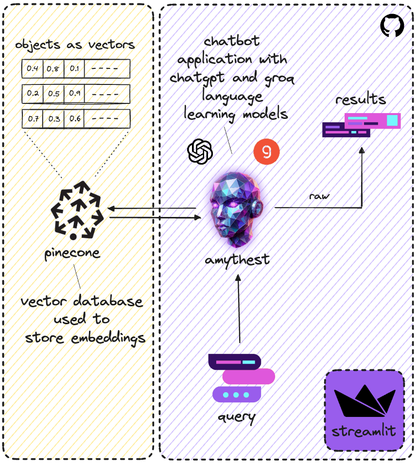

<!--AMYTHEST Banner-->

  

 

<!--Add links for app, docs, demo, and LinkedIn profile-->

  <b> <a href='https://amythest.streamlit.app/'>Application</a> | <a href='https://tyrawls.github.io/healthcare-ai-patient-education-chatbot'>Documentation</a> | <a href=''>Demo</a> | <a href='https://www.linkedin.com/in/tyrellrawls/'>LinkedIn</a> </b>

# AMYTHEST

[**AMYTHEST**](https://amythest.streamlit.app/) (AI Messaging Yielding Thoughtful Human-like Engagement Systems Technology) is an AI chatbot developed to deliver high-quality health education materials utilizing Retrieval-Augmented Generation (RAG), thereby improving outcomes for both patients and healthcare providers.

### ⚡ Key Features

* Accepts health-related input queries and provides a response based on the query
* Modify user chat bubble and icon color
* Choose between three different Language Learning Models (LLM):
    * OpenAI - ChatGPT 4o
    * META - LLaMA 3
    * Google - Gemma

### 🧠 How It Works

[**AMYTHEST**](https://amythest.streamlit.app/) uses RAG technology which is a method that enhances the generation of text by integrating relevant information retrieved from a knowledge base or dataset to provide more accurate and contextually appropriate responses.

A user input query is converted into a vector embedding, which is then compared to the documents in the Pinecone database to retrieve the most relevant matches. The identified documents are subsequently provided to the LLM to generate a human-like response.

<!--RAG Architecture-->

  

