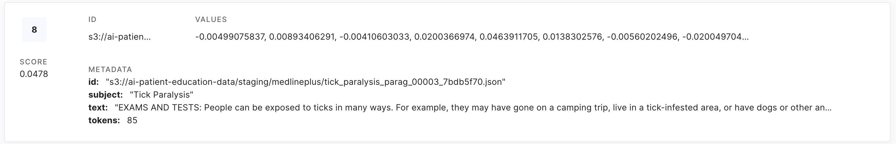

About
=====
Patient education plays a crucial role in the healthcare profession, offering numerous benefits to both patients and healthcare providers alike. 
By empowering patients with comprehensive knowledge about their health conditions, treatment options, and preventive measures, patient education 
fosters informed decision-making and encourages active participation in healthcare management. This leads to improved treatment adherence, better 
health outcomes, and reduced healthcare costs. Additionally, patient education promotes patient autonomy and self-care, ultimately enhancing 
overall patient satisfaction and quality of life. Moreover, healthcare providers benefit from reduced patient visits, enhanced communication, 
and strengthened patient-provider relationships, resulting in more efficient healthcare delivery and improved patient care experiences.

#################
Problem Statement
#################

Low health literacy among patients poses a significant challenge, as it impedes their ability to comprehend medical information, follow instructions, 
and recognize the importance of their treatments. This difficulty in understanding can severely limit their capacity to manage their health effectively. 
Additionally, healthcare professionals often face time constraints during appointments, preventing them from delivering thorough patient education, 
which results in many patients receiving inadequate information about their health.

#########################
Project Goals & Non-goals
#########################

Inclusions
----------
* **Develop an AI Chatbot:** Develop an AI-driven chatbot, named `AMYTHEST <https://amythest.streamlit.app/>`_ (AI Messaging Yielding Thoughtful Human-like Engagement Systems Technology), to provide high-quality health education materials.
* **Enhance Health Literacy:** Improve patient understanding of health information to promote better health management.
* **Improve Treatment Adherence:** Increase compliance with treatment plans by providing clear and accessible health information.

Exclusions
----------
* **Not Focused on Reducing Healthcare Costs:** Although well-informed patients who effectively manage their conditions are less likely to need emergency care or frequent hospitalizations, the primary aim of this project is not to reduce healthcare costs.
* **Not Intended to Alleviate Provider Workload:** This project does not seek to replace healthcare providers or diminish their workload. Instead, it is designed to serve as an educational resource to supplement patient knowledge.

#################
Technical Details
#################

.. figure:: img/ai_chatbot_data_architecture.png
   :width: 800   
   :alt: Data architecture

   ETL architecture for ingesting health-related data, performing transformations, and storing it in a vector database for reference by an AI 
   chatbot utilizing Retrieval-Augmented Generation (RAG)

Data Extraction
---------------
Health-related data was extracted from `MedlinePlus <https://medlineplus.gov/>`_ using Python. Utilizing 
`Boto3 <https://boto3.amazonaws.com/v1/documentation/api/latest/index.html>`_, a Python library for interfacing 
with `Amazon S3 <https://aws.amazon.com/pm/serv-s3/>`_, the raw data was subsequently stored in an Amazon S3 bucket
as a text file (.txt) for preprocessing purposes.

Health-related data was retrieved from `MedlinePlus <https://medlineplus.gov/>`_ using Python, encompassing four distinct sections:

- `Medical Encyclopedia Articles <https://medlineplus.gov/encyclopedia.html>`_: The A.D.A.M or Animated Dissection of Anatomy for Medicine Medical Encyclopedia includes over 4,000 articles about diseases, tests, symptoms, injuries, and surgeries.
- `Laboratory Tests <https://medlineplus.gov/lab-tests/>`_: Medical tests can help detect a condition, determine a diagnosis, plan treatment, check to see if treatment is working, or monitor the condition over time.
- `Medical Drugs <https://medlineplus.gov/druginformation.html>`_: Contains prescription and over-the-counter medication information from American Hospital Formulary Service Drug Information (AHFS DI), the most comprehensive evidence-based source of drug information complete with therapeutic guidelines and off-label uses.
- `Genetic Conditions <https://medlineplus.gov/genetics/>`_: Provides information on the signs, symptoms, causes, and inheritance of more than 1,300 health conditions with a genetic basis.
- `Healthy Recipes <https://medlineplus.gov/recipes/>`_: Contains recipes that guide you in preparing delicious, nutritious meals to support the development of a healthy eating pattern.

Utilizing `Boto3 <https://boto3.amazonaws.com/v1/documentation/api/latest/index.html>`_, a Python library for interfacing with Amazon S3, the raw data was subsequently stored in an Amazon S3 bucket as a text file (.txt) for preprocessing purposes.

Data Transformation
-------------------
An `AWS Lambda <https://aws.amazon.com/pm/lambda/>`_ function was used to preprocess the raw data in S3 into smaller chunks, 
ensuring it met the token constraints for vector embedding. The processed data was then staged in another S3 bucket.

Data Loading
------------
Another AWS Lambda function was utilized to process the staged data in S3 into vector embeddings using the 
`Voyage AI API <https://docs.voyageai.com/docs/introduction>`_ (voyage-large-2 model). These embeddings were then 
stored in `Pinecone <https://docs.pinecone.io/home>`_, a vector database, with the following metadata format:

* **id:** The S3 Uniform Resource Identifier (URI), encompassing the bucket name and file key (s3://bucket_name/file_key) of the document.
* **subject:** Title of the document
* **text:** Contains the context of the document
* **tokens:** Total amount tokens in a document

   Sample data from the Pinecone database

Data Privacy & Security
-----------------------
To ensure data privacy and security, a process was implemented to eliminate highly confidential (C4) data. This 
category includes the most sensitive information, whose unauthorized disclosure could result in severe legal, financial, 
or security repercussions.

Prior to storing the chatbot history in an S3 bucket, names, dates of birth, locations, and phone numbers were removed 
through a process called desensitization using an Amazon Lambda function.

Chatbot Deployment
------------------
For a simple and cost-effective deployment, `AMYTHEST <https://amythest.streamlit.app/>`_ was implemented using Streamlit.

Key Features
^^^^^^^^^^^^
* Accepts health-related input queries and provides a response based on the query
* Modify user chat bubble and icon color
* Choose between three different Language Learning Models (LLM):
    * OpenAI - ChatGPT 4o
    * META - LLaMA 3
    * Google - Gemma
* Returns health-related information based on query

How Does It Work?
^^^^^^^^^^^^^^^^^
AMYTHEST uses RAG technology which is a method that enhances the generation of text by integrating relevant information retrieved from 
a knowledge base or dataset to provide more accurate and contextually appropriate responses.

A user input query is converted into a vector embedding, which is then compared to the documents in the Pinecone database to retrieve 
the most relevant matches. The identified documents are subsequently provided to the LLM to generate a human-like response.

