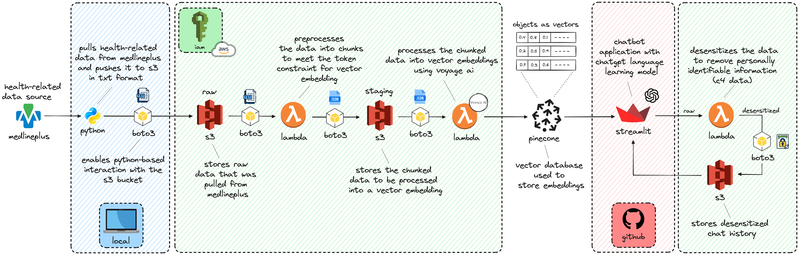

About
=====
Patient education plays a crucial role in the healthcare profession, offering numerous benefits to both patients and healthcare providers alike. 
By empowering patients with comprehensive knowledge about their health conditions, treatment options, and preventive measures, patient education 
fosters informed decision-making and encourages active participation in healthcare management. This leads to improved treatment adherence, better 
health outcomes, and reduced healthcare costs. Additionally, patient education promotes patient autonomy and self-care, ultimately enhancing 
overall patient satisfaction and quality of life. Moreover, healthcare providers benefit from reduced patient visits, enhanced communication, 
and strengthened patient-provider relationships, resulting in more efficient healthcare delivery and improved patient care experiences.

#################
Problem Statement
#################

Low health literacy among patients poses a significant challenge, as it impedes their ability to comprehend medical information, follow instructions, 
and recognize the importance of their treatments. This difficulty in understanding can severely limit their capacity to manage their health effectively. 
Additionally, healthcare professionals often face time constraints during appointments, preventing them from delivering thorough patient education, 
which results in many patients receiving inadequate information about their health.

#########################
Project Goals & Non-goals
#########################

Inclusions
----------
* Develop an AI Chatbot: Create an AI-driven chatbot to deliver high-quality health education materials.
* Enhance Health Literacy: Improve patient understanding of health information to promote better health management.
* Improve Treatment Adherence: Increase compliance with treatment plans by providing clear and accessible health information.

Exclusions
----------
* Not Focused on Reducing Healthcare Costs: Although well-informed patients who effectively manage their conditions are less likely to need emergency care or frequent hospitalizations, the primary aim of this project is not to reduce healthcare costs.
* Not Intended to Alleviate Provider Workload: This project does not seek to replace healthcare providers or diminish their workload. Instead, it is designed to serve as an educational resource to supplement patient knowledge.

#################
Technical Details
#################

   ETL architecture for ingesting health-related data, performing transformations, and storing it in a vector database for reference by an AI 
   chatbot utilizing Retrieval-Augmented Generation (RAG).

Data Extraction
---------------
Health-related data was extracted from `MedlinePlus <https://medlineplus.gov/>`_ using Python. Utilizing 
`Boto3 <https://boto3.amazonaws.com/v1/documentation/api/latest/index.html_>`, a Python library for interfacing 
with Amazon S3, the raw data was subsequently stored in an Amazon S3 bucket as a text file (.txt) for 
preprocessing purposes.

